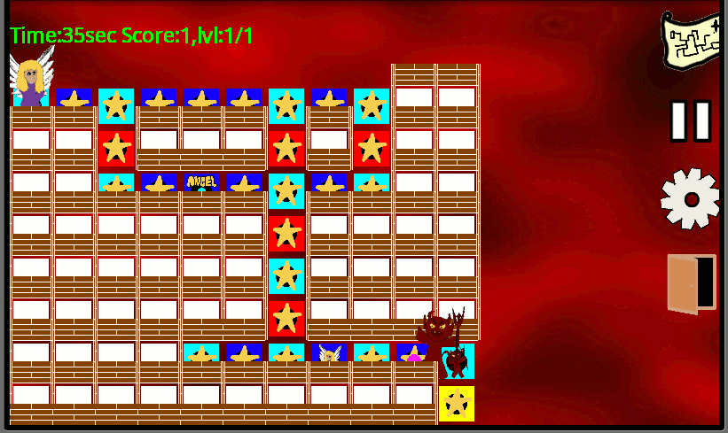
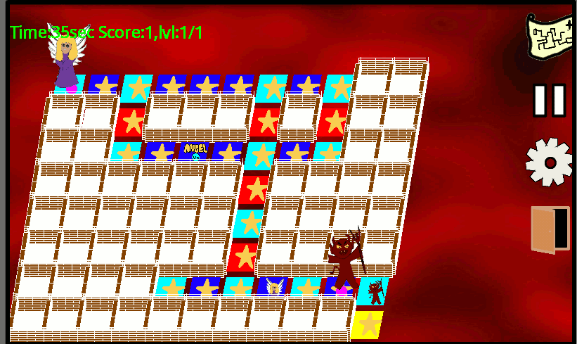
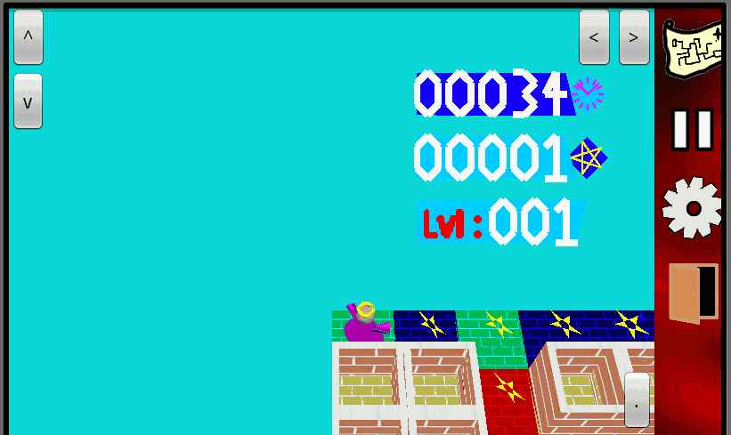
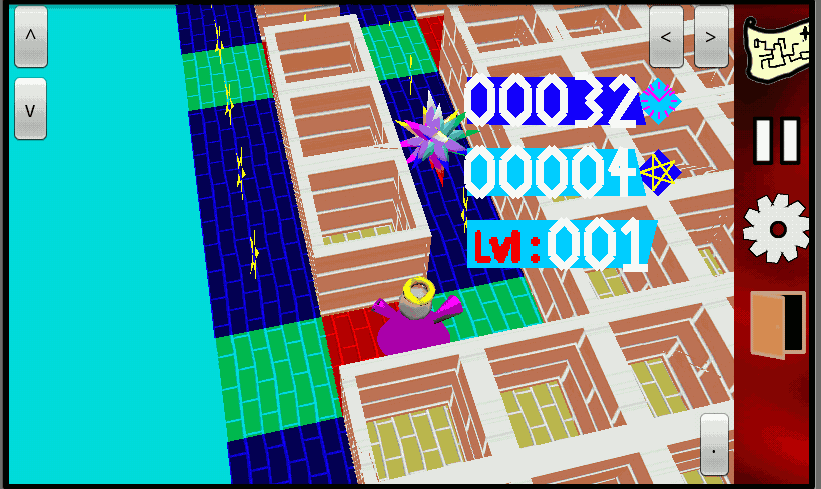
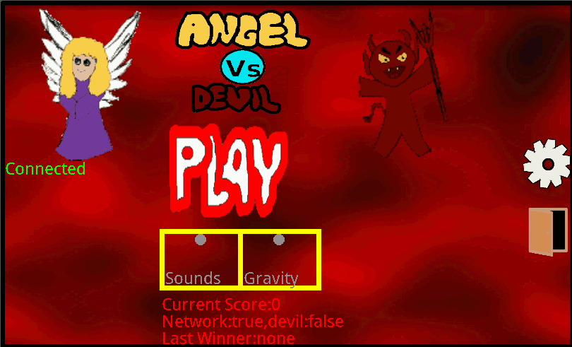
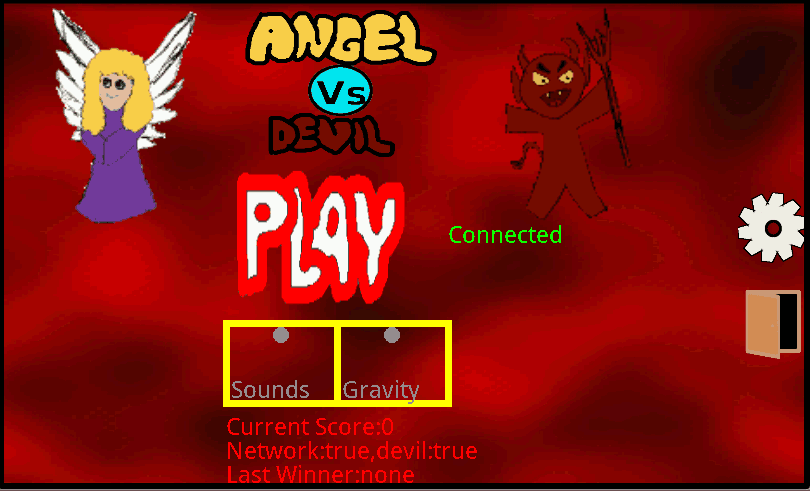
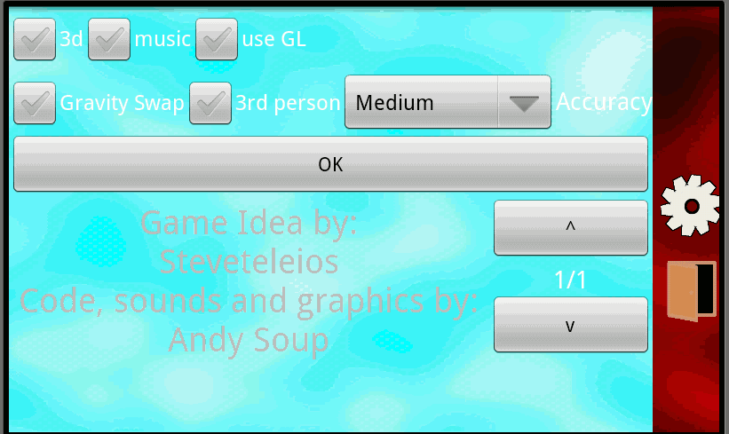
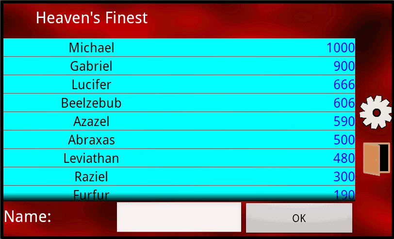
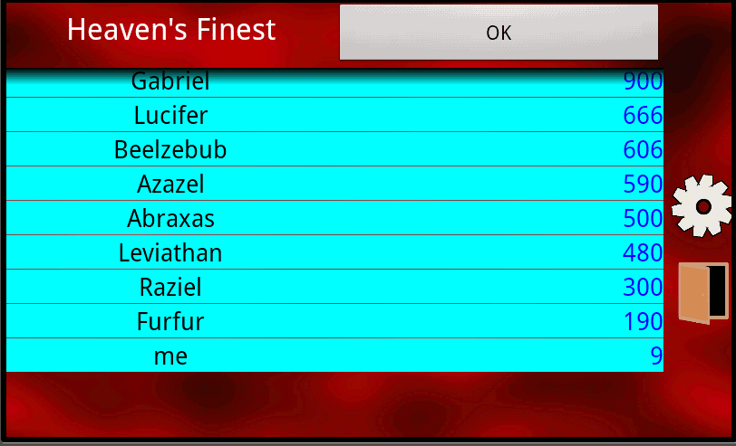

# Angel.V.Devil

### An android game for kids

Angel.V.Devil is a chase/maze game.
Players play a lost angel looking for the way out of a hellish maze.
At the maze exit an _evil_ devil lurks.
If the two meet our poor angel is doomed, as he is no match for the devils _poking_ trident.
_Unless..._
Somewhere in the maze there is a hammer the angel can pick up to _bong_ the mischievous devil and dizzy him for a while.
But wait... the devil is not all our heroic angel has to deal with:
The sneaky devil has installed a devilish field at the maze exit that only he can pass through.
Thankfully somewhere in the maze there is also a bright spike. The angel can use it to disable the fiendish field and exit to heaven's freedom.

## How to play

The angel is controlled with swipes, and, in GL mode, the control buttons at the edges of the screen.

| **Swipe** | Button
 | **to move** |
| from left to right | >
 | right |
| from right to left | <
 | left |
| from bottom to top
 | ^
 | up
 |
| from top to bottom
 | v
 | down
 |
| Single tap
 | .
 | halt
 |

If your phone supports it, it is also possible to move using gravity.
To play with gravity it must be enabled in the start screen.
Touch Gravity to turn it green and then in the game slide the phone as you would to let gravity pull you.
If you play the game on a tablet you may need to turn on Gravity Swap, as some tablets gravity sensors are inverted.
The angel will be able to collect stars in the maze to increase the score.

## Display modes

| 

There are various display modes.
Plain mode shows the complete map  in a simple way.
3d mode has a little more perspective but still displays the whole map.
GL mode used openGL for the rendering and follows the player
3rd person mode moves the camera behind the player and modifies the controls so that

| **Swipe** |
| left to right | right |
| right to left | **To Turn** | left |
| top to bottom | back |
| bottom to top | **To move** | forward |
| Single tap | **To**
 | halt
 |

 | 

| Plain mode:
 | 3d mode:
 |
| Gl mode:
 | 3rd person mode:
 |

 |

## Network mode

With two phones in the same wi-fi network a player can take the part of the devil to play a chase game.
Connect to a local Wi-Fi network before using the network mode.

In this mode the devil is able to pickup the stars hammer and spike, however passing through his demonic field will destroy it so the angel can escape.
The angel wins by escaping, the devil by catching the angel.

The game will start only after **both** players touch Start

## Start Screen

*   Touch The Angel V Devil logo to go to the settings screen

*   Touch Sound to toggle sound on and off

*   Touch Gravity if you phone has an accelerometer to enable control by gravity

*   Touch Play to start playing the current level

*   Touch the bottom status bar of red letters to see the high scores table

*   Touch the angel on the left to begin a network game as the angel. A pop up window will display the IP address of your phone. The devil will need that info to connect to your phone.

*   On the other phone, touch the devil on the right to join a network game as the devil. A pop up window will ask you for the IP address of the phone the angel is playing on. Touch "Suggest" to let your phone autotype the first three numbers, and fill in the IP address from your the phone of your friend playing the angel. Touch ok and wait for the connection.

| Angel connected screen:

 | Devil connected screen:

 |

## Settings Screen

| **Toggles**
 | **Use**
 |
| 3d | enables the perspective view of the map |
| music | turns music on or off
 |
| use GL
 | enable/disable use of openGL game view
 |
| Gravity Swap
 | Interchanges the x-y controls for gravity (when accelerometer is in use)
 |
| 3rd person
 | Modifies controls for third person, and moves camera behind player in GL mode
 |

If no game is in progress the player can also select the starting level here.
Touch OK to close the settings screen and go back.

## Game Screen

Here the player tries to win the level by reaching the maze exit at the bottom right.
Use the controls to move the angel, escaping the devil, or using the hammer to dazzle him, find the spike and exit the maze.
Right side controls:

| Map Icon
 | To toggle use of GL
 |
| Pause
 | To pause/unpause the game
 |
| Settings
 | To enter the settings screen. This will automatically pause the game
 |
| Door
 | To exit
 |

Using the door to exit will resign the game, the devil will be considered the winner and the game will end.

## High Scores table

If you score is high enough, when the game ends you will be prompted for your name:

Touch the white area next to Name, type your name and then ok.
Your name will appear in the list:

Touch OK at the top of the screen to go back to the start screen.

